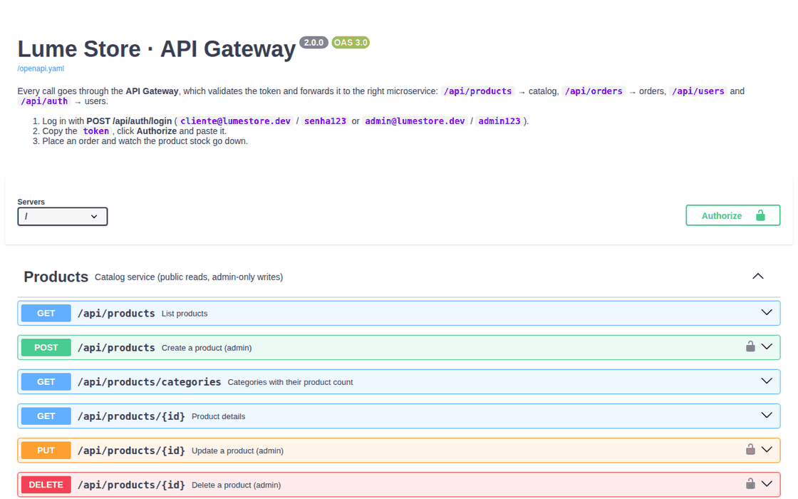
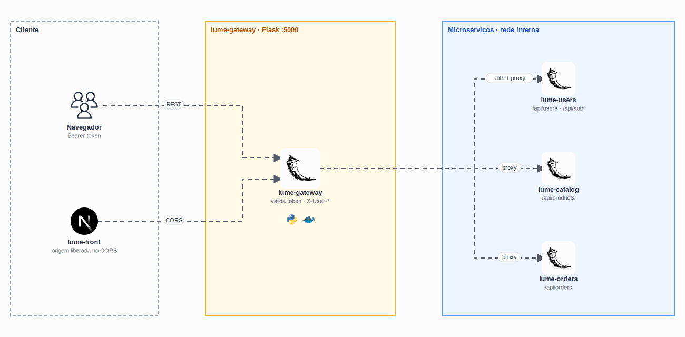

<p align="center">
  <picture>
    <source media="(prefers-color-scheme: dark)" srcset="docs/logo-dark.svg" />
    
  </picture>
</p>

<h1 align="center">
  Lume Store · Gateway
</h1>

<p align="center">
  
</p>

<p align="center">
  <a href="https://skillicons.dev">
    
  </a>
</p>

## Qual a finalidade do projeto?

**API Gateway** da Lume Store: o único serviço de API exposto para fora da rede Docker. Toda chamada do front passa por ele, que valida o token de sessão no serviço de usuários, aplica as regras de acesso e repassa a chamada ao microserviço certo, com o usuário autenticado nos headers internos.

Assim os microserviços ficam isolados, a autenticação fica num lugar só e o front conhece um único endereço.

## Arquitetura

<p align="center">
  
</p>

## O que foi construído

### Roteamento

| Prefixo | Microserviço |
|---|---|
| `/api/products` | [lume-catalog](https://github.com/lume-store-org/lume-catalog) |
| `/api/orders` | [lume-orders](https://github.com/lume-store-org/lume-orders) |
| `/api/users`, `/api/auth` | [lume-users](https://github.com/lume-store-org/lume-users) |

### Regras de acesso

| Rota | Acesso |
|---|---|
| `GET /api/products/**` | Público |
| `POST /api/users` (cadastro), `POST /api/auth/login`, `POST /api/auth/logout` | Público |
| Todo o resto | Exige `Authorization: Bearer <token>` |

Com o token válido, o gateway envia `X-User-Id` e `X-User-Admin` ao microserviço. Headers com esses nomes vindos do cliente são **descartados**, então ninguém consegue se passar por admin.

### Outras rotas

| Rota | O que faz |
|---|---|
| `GET /health` | Status do gateway e dos três microserviços |
| `GET /docs` | Swagger UI da API ([`openapi.yaml`](openapi.yaml)) |

## Tecnologias utilizadas

- **Python 3.12 + Flask 3 + Gunicorn**;
- **Requests:** repasse das chamadas;
- **Flask-CORS:** libera só a origem do front (`FRONTEND_ORIGIN`);
- **OpenAPI 3 + Swagger UI**;
- **Docker:** imagem sem root, com healthcheck.

## Estrutura do repositório

```text
lume-gateway/
├── app.py            # Proxy, autenticação, CORS, logs e /docs
├── openapi.yaml      # Especificação da API
├── requirements.txt
├── Dockerfile
└── docs/             # Logo, demo e diagrama
```

## Fluxo de funcionamento

1. Chega `POST /api/orders` com `Authorization: Bearer <token>`.
2. O gateway chama `POST /auth/verify` no `lume-users` e recebe o usuário.
3. Monta os headers internos (`X-User-Id`, `X-User-Admin`), descartando os que vieram do cliente.
4. Repassa para `http://lume-orders:5002/orders` e devolve a resposta ao front.
5. O log registra só método, caminho, status e tempo, **sem corpo e sem token**.

## Variáveis de ambiente

| Variável | Padrão |
|---|---|
| `CATALOG_SERVICE_URL` | `http://lume-catalog:5001` |
| `ORDERS_SERVICE_URL` | `http://lume-orders:5002` |
| `USERS_SERVICE_URL` | `http://lume-users:5003` |
| `FRONTEND_ORIGIN` | `http://localhost:3000` |

## Como rodar

A stack completa sobe pelo [lume-infra](https://github.com/lume-store-org/lume-infra). Com ela no ar, a documentação interativa fica em **http://localhost:5000/docs**.

## Como validar a entrega

No Swagger, com as contas de teste (`cliente@lumestore.dev` / `senha123`):

- `GET /api/products?search=fone` responde sem login;
- `GET /api/orders` sem token devolve `401`;
- depois do **Authorize**, `POST /api/orders` cria o pedido com os preços do catálogo;
- `GET /api/users` com o token do cliente devolve `403`.

## Projeto Lume Store

| Repositório | Camada |
|---|---|
| [lume-front](https://github.com/lume-store-org/lume-front) | Loja (Next.js) |
| [lume-gateway](https://github.com/lume-store-org/lume-gateway) | API Gateway (Flask) |
| [lume-users](https://github.com/lume-store-org/lume-users) | Microserviço de usuários |
| [lume-catalog](https://github.com/lume-store-org/lume-catalog) | Microserviço de catálogo |
| [lume-orders](https://github.com/lume-store-org/lume-orders) | Microserviço de pedidos |
| [lume-infra](https://github.com/lume-store-org/lume-infra) | Docker Compose com a stack completa |

## Autor

**William Alves Coelho** · [@willtechdev](https://github.com/willtechdev)
